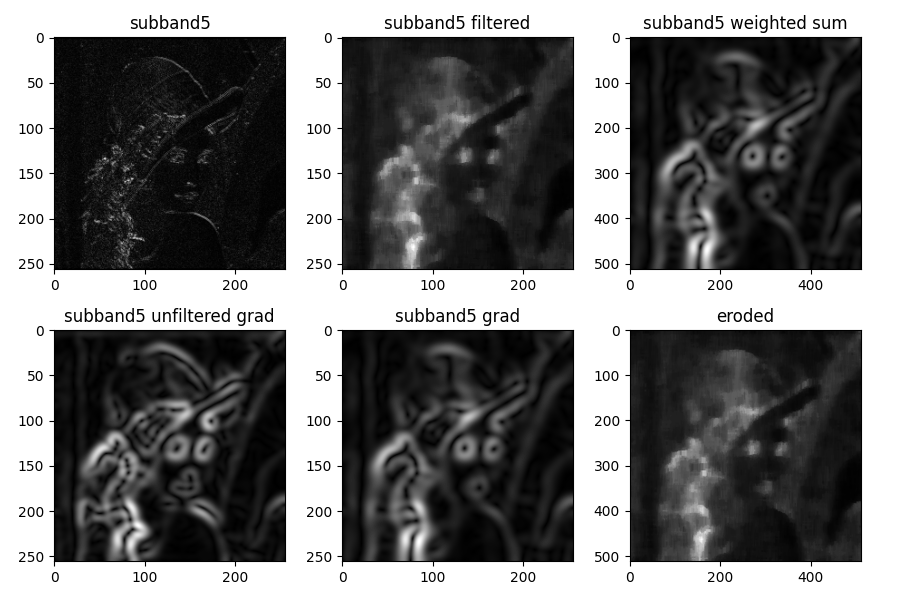
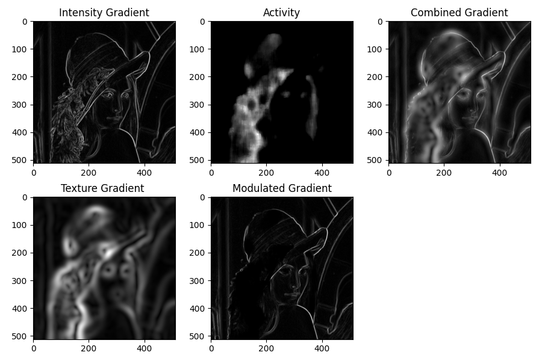

<h1>DTCWT-based Image Fusion</h1>

In this project I replicated <a href="https://ieeexplore.ieee.org/document/1369329">Callaghan et al., 2004</a>'s process to fuse the intensity and texture gradients of an image using the Dual Tree Complex Wavelet Transform (DTCWT).

  

    

    To calculate the intensity gradient of the grayscale image, I calculated the Sobel gradient magnitude in the (x,y) directions. Then, I applied the DTCWT to generate 6 different highpass subbands roughly corresponding to 15, 45, 75, 105, 135, 165 degrees correspondingly.

  

    Next, a seperable median filter was applied to each wavelet subband perform nonlinear noise removal. To extract the texture gradient, the Gaussian derivative function was applied in the x and y directions. To fuse the texture gradient information from multiple subbands, the following equations were used:

    
$\Large{TG(x,y) = \sum_{i,\theta}interp(\omega_{i,\theta}\cdot\widehat{TG}_{i,\theta}(x,y))}$, where

$\Large{\widehat{TG}_{i,\theta}(x,y)} = \frac{TG_{i,\theta}(x,y)}{max_{x,y}(\widehat{TG}_{i,\theta}(x,y))}$, and 
$\Large{\omega_{i,\theta}= \frac{N_i}{\sum{_{x,y}}\widehat{TG}}_{i,\theta}(x,y)^2}$, 
with $N_i$ representing the number of pixels in each subband (256x256 pixels in this case). Images were then upsampled to the original image size of 512x512.
 
 

 Put into simplified terms: the texture gradient for each subband is normalized between the range [0,1] and then multiplied by a weight. This is then summed across all bands to calculate $TG_(x,y)$. Below are the results that I got for the subband representing $135^{\circ}$ (aka $-45^{\circ}$). 
  

    

 

    Next, to address the issue of the intensity gradient responding undesirably to ordinary textures within patches of homogeneous texture (ex: the scarf within the Lena image), the intensity gradient must be modulated by the texture gradient in which it is suppressed within textured regions, and unchanged in smooth areas. This is performed by using the following equations.  

$\Large{Activity(x,y) = e^{\mathcal{R}_{half}(\frac{E_{tex}(x,y)}{\alpha} - \beta)}}$, where $\mathcal{R}(\zeta)$ represents a half-wave rectification to suppress negative exponents (in other words, the ReLU function implemented in numpy as np.maximum()). $\alpha$ was chosen to be 2, whereas $\beta$ was chose to be 7.
   
Since the texture features respond in a slightly larger area than desired, an erosion function was implemented with a kernel size [3,3]. Thus, $\Large{E_{text} = \sum_{i,\theta}interp(filtered subband)}$.

Lastly, this is then plugged into the below equation to calculate the fused intensity-texture gradient for the image and its subbands:
$\Large{GS(x,y) = \frac{|\nabla I|}{Activity(x,y)\cdot \omega_I} + \frac{TG(x,y)}{\omega_T}}$, where $\omega_I$ represents 4x the median intensity gradient, and $\omega_T$ represents the median texture gradient. The below figure are my results. The textures within the intensity gradient are suppressed with respect to that of the calculated activity (see modulated gradient). The end result can be seen at the very right.

    

